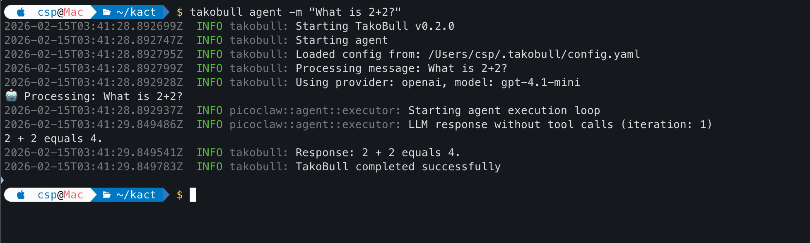
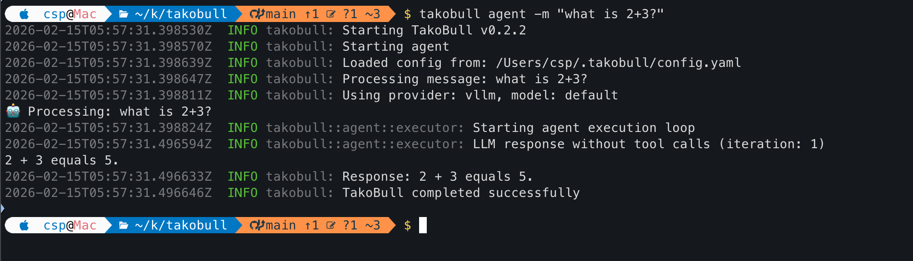
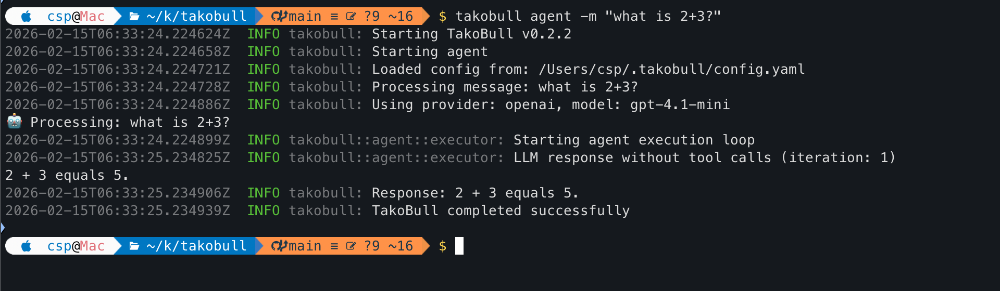
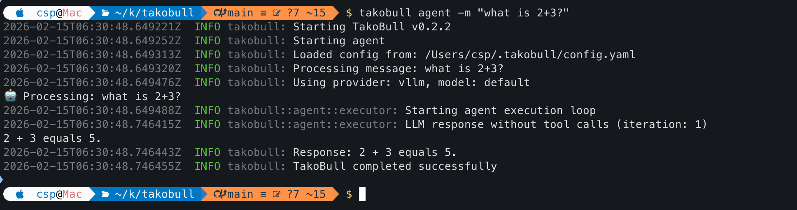
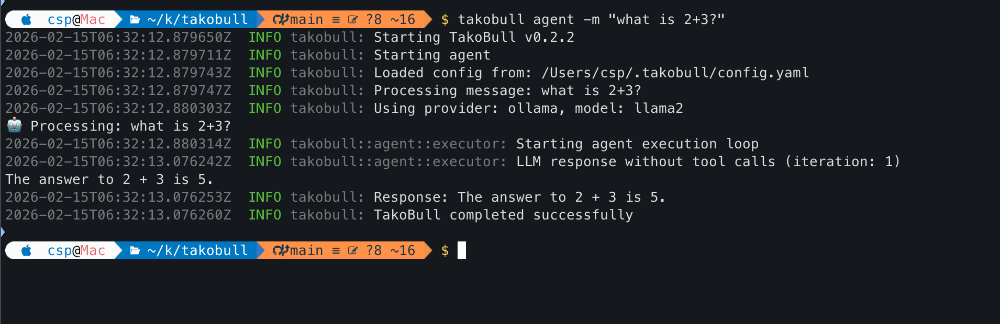

<div align="center">

  <picture>
    <source media="(prefers-color-scheme: dark)" srcset="image/logo/logo-dark_theme.png" width="200">
    
  </picture>

  <h1>TakoBull: Ultra-Efficient AI Assistant in Rust</h1>

  <h3>$10 Hardware · 10MB RAM · 1s Boot · 🤖 Powered by Rust</h3>

  <p>
    
    
    
  </p>
</div>

---

🤖 **TakoBull** is an ultra-lightweight personal AI Assistant, a high-performance Rust port of  [PicoClaw](https://github.com/sipeed/picoclaw). Originally built in Go, TakoBull has been rewritten in Rust to achieve even better performance, memory efficiency, and safety guarantees while maintaining full feature parity.

⚡️ Runs on $10 hardware with <10MB RAM: That's 99% less memory than traditional AI assistants and 98% cheaper than a Mac mini!

## ✨ Features

🪶 **Ultra-Lightweight**: <10MB Memory footprint — 99% smaller than traditional AI assistants.

💰 **Minimal Cost**: Efficient enough to run on $10 Hardware — 98% cheaper than a Mac mini.

⚡️ **Lightning Fast**: 400X Faster startup time, boot in 1 second even on 0.6GHz single core.

🌍 **True Portability**: Single self-contained binary across RISC-V, ARM, and x86.

⚡ **High Performance**: Memory-safe, high-performance implementation with zero-cost abstractions.

|                               | Traditional AI | PicoClaw (Go)            | **TakoBull (Rust)**                        |
| ----------------------------- | -------------- | ------------------------ | ----------------------------------------- |
| **Language**                  | TypeScript     | Go                       | **Rust**                                  |
| **RAM**                       | >1GB           | <10MB                    | **<10MB**                                 |
| **Startup**</br>(0.8GHz core) | >500s          | <1s                      | **<1s**                                   |
| **Cost**                      | Mac Mini 599$  | Any Linux Board ~50$     | **Any Linux Board**</br>**As low as 10$** |
| **Memory Safety**             | No             | No                       | **Yes (Rust)**                            |

## 📦 Build & Install

### Prerequisites

- Install Rust from https://rustup.rs/

### Build

```bash
# Clone the repository
git clone git@github.com:kactlabs/takobull.git
cd takobull

# Build in release mode (optimized for embedded)
cargo build --release

# Binary location: target/release/takobull
```

### Install Globally

```bash
# Install the binary to ~/.cargo/bin/
cargo install --path .

# Now you can run from anywhere:
takobull agent -m "What is 2+2?"
```

## 🚀 Quick Start

### 1. Initialize Workspace

```bash
takobull onboard
```

This creates `~/.takobull/` with default configuration.

### 2. Configure Your LLM Provider

Edit `~/.takobull/config.yaml` and set your API key:

```yaml
agents:
  defaults:
    provider: openai
    model: gpt-4-mini
    workspace: ~/.takobull/workspace

providers:
  openai:
    api_key: "your-api-key-here"
    api_base: "https://api.openai.com/v1"
```

### 3. Run the Agent

```bash
# Send a message
takobull agent -m "Write a Python function to sort a list"

# Override provider and model for a single execution
takobull agent -p openai --md gpt-4-mini -m "What is 2+2?"
takobull agent -p gemini --md gemini-2.5-flash -m "Explain Rust ownership"
takobull agent -p ollama --md llama2 -m "Write a hello world in Python"

# Start the gateway (for channel integrations)
takobull gateway

# Check system status
takobull status

# Manage scheduled tasks
takobull cron list
```

## �️ CLI Commands

| Command                   | Description                   |
| ------------------------- | ----------------------------- |
| `takobull onboard`         | Initialize config & workspace |
| `takobull agent -m "..."` | Chat with the agent           |
| `takobull agent -p <provider> --md <model> -m "..."` | Override provider/model for single execution |
| `takobull agent`           | Interactive chat mode         |
| `takobull gateway`         | Start the gateway             |
| `takobull status`          | Show system status            |
| `takobull cron list`       | List all scheduled jobs       |

### Agent Command Options

| Option | Short | Description | Example |
|--------|-------|-------------|---------|
| `--message` | `-m` | Message to send to the agent | `-m "What is 2+2?"` |
| `--provider` | `-p` | Override provider for this execution | `-p openai` |
| `--md` | | Override model for this execution | `--md gpt-4-mini` |
| `--config` | `-c` | Path to configuration file | `-c custom-config.yaml` |
| `--log-level` | `-l` | Log level (debug, info, warn, error) | `-l debug` |
| `--verbose` | `-v` | Enable verbose output | `-v` |

## 🤖 Supported LLM Providers

- OpenAI (GPT-4, GPT-4 Mini, GPT-3.5) ✅ Full tool calling
- Anthropic Claude ✅ Full tool calling
- OpenRouter ✅ Full tool calling
- Google Gemini ✅ Full tool calling
- Ollama ✅
  - Tool calling supported with: llama3.1+, llama3.2+, qwen2.5-coder, mistral, deepseek-coder
  - Conversational mode for base models: llama2, codellama
- vLLM / llama.cpp ✅ Conversational mode
- Zhipu (智谱) (To be implemented soon)
- DeepSeek (To be implemented soon)
- Groq (To be implemented soon)

## 💬 Supported Channels

- Telegram (TBI - To be implemented)
- Discord (TBI - To be implemented)
- DingTalk (TBI - To be implemented)
- LINE (TBI - To be implemented)
- QQ (TBI - To be implemented)
- WhatsApp (TBI - To be implemented)
- Slack (TBI - To be implemented)
- Feishu (TBI - To be implemented)

## 🔧 Available Tools

- **Web Search**: Brave Search, DuckDuckGo (TBI - To be implemented)
- **Filesystem**: Read, write, list files with workspace isolation (TBI - To be implemented)
- **Shell**: Execute commands with timeout and whitelist (TBI - To be implemented)
- **Web Access**: Fetch and parse web content (TBI - To be implemented)
- **Hardware**: I2C and SPI device control (TBI - To be implemented)
- **Message**: Send messages to channels (TBI - To be implemented)
- **Cron**: Schedule automated tasks (TBI - To be implemented)

## ⚙️ Configuration

Config file: `~/.takobull/config.yaml`

### Workspace Layout

TakoBull stores data in your configured workspace (default: `~/.takobull/workspace`):

```
~/.takobull/workspace/
├── sessions/          # Conversation sessions and history
├── memory/           # Long-term memory
├── state/            # Persistent state
├── cron/             # Scheduled jobs database
├── skills/           # Custom skills
└── files/            # User files
```

### 🔒 Security Sandbox

TakoBull runs in a sandboxed environment by default. The agent can only access files and execute commands within the configured workspace.

```yaml
agents:
  defaults:
    workspace: ~/.takobull/workspace
    restrict_to_workspace: true
```

| Option | Default | Description |
|--------|---------|-------------|
| `workspace` | `~/.takobull/workspace` | Working directory for the agent |
| `restrict_to_workspace` | `true` | Restrict file/command access to workspace |

#### Protected Tools

When `restrict_to_workspace: true`, the following tools are sandboxed:

| Tool | Function | Restriction |
|------|----------|-------------|
| `write_file` | Write files | Only files within workspace |
| `read_file` | Read files | Only files within workspace |
| `shell` | Execute commands | Command paths must be within workspace |

#### Disabling Restrictions (Security Risk)

If you need the agent to access paths outside the workspace:

```yaml
agents:
  defaults:
    restrict_to_workspace: false
```

> ⚠️ **Warning**: Disabling this restriction allows the agent to access any path on your system. Use with caution in controlled environments only.

## 🐳 Docker Support

TakoBull can be deployed using Docker for consistent environments:

```bash
# Build Docker image
docker build -t takobull:latest .

# Run with configuration
docker run -v ~/.takobull:/root/.takobull takobull:latest agent -m "What is 2+2?"

# Run gateway for channel integrations
docker run -v ~/.takobull:/root/.takobull -p 18790:18790 takobull:latest gateway
```

## 🧪 Development

```bash
# Build in debug mode (faster compilation)
cargo build

# Run tests
cargo test

# Run tests with output
cargo test -- --nocapture

# Run property-based tests
cargo test --test '*' -- --nocapture

# Watch for changes and rebuild (requires cargo-watch)
cargo watch -x build
```

## 📊 Implementation Status

All 39 tasks completed across 6 phases:
- Phase 1: Core Infrastructure ✅
- Phase 2: Authentication & Agent Loop ✅
- Phase 3: Channel Integrations ✅
- Phase 4: LLM Providers ✅
- Phase 5: Tools System ✅
- Phase 6: Integration & Optimization ✅

47 tests passing with zero failures. See [CHANGELOG.md](CHANGELOG.md) for detailed implementation notes.

## 🐛 Troubleshooting

### API key not configured

Make sure your `~/.takobull/config.yaml` has the correct API key for your chosen provider:

```yaml
providers:
  openai:
    api_key: "your-actual-key-here"
```

### Web search not working

This is normal if you haven't configured a search API key yet. TakoBull will automatically fall back to DuckDuckGo.

To enable Brave Search:

1. Get a free API key at [https://brave.com/search/api](https://brave.com/search/api) (2000 free queries/month)
2. Add to `~/.takobull/config.yaml`:

```yaml
tools:
  web:
    brave:
      enabled: true
      api_key: "YOUR_BRAVE_API_KEY"
      max_results: 5
```

### Binary not found after install

Make sure `~/.cargo/bin` is in your PATH:

```bash
export PATH="$HOME/.cargo/bin:$PATH"
```

Add this to your shell profile (`~/.bashrc`, `~/.zshrc`, etc.) to make it permanent.

## 🤝 Contributing

PRs welcome! The codebase is intentionally small and readable. 🤗


## Screenshots





### OpenAI
```
provider: "openai"
model: "gpt-4.1-mini"

openai:
    api_key: "sk.."
    api_base: "https://api.openai.com/v1"
```


### Llama.cpp
```
provider: "vllm"
model: "default"

vllm:
    api_key: "none"
    api_base: "http://0.0.0.0:8080/"
```



### Ollama
```
provider: "ollama"
model: "llama2"

  vllm:
    api_key: "none"
    api_base: "http://0.0.0.0:11434/"
```


## 📝 License

MIT License - See LICENSE file for details.
